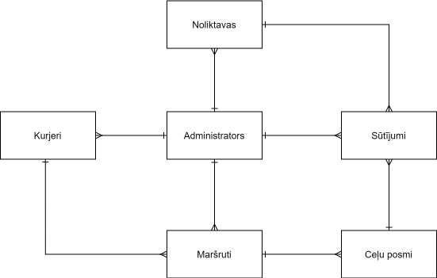

# Ievads
Preču piegādes maršrutēšana 
## Problēmas nostādne
Loģistikas uzņēmumiem un preču piegādes pakalpojumu sniedzējiem efektīva maršrutēšana ir būtiska, lai samazinātu izdevumus, optimizētu piegādes laiku un uzlabotu klientu apmierinātību. Pārāk ilgi vai neefektīvi maršruti rada palielinātus degvielas izdevumus, resursu izšķērdēšanu un nepārskatāmību par piegāžu statusu. Optimizēta preču piegādes maršrutēšanas sistēma var palīdzēt uzņēmumam labāk izplānot piegādes maršrutus, pielāgojoties dažādiem klientu pieprasījumiem un piegādes apstākļiem.
### Lietotāju stāsti
| Nr.   | Lietotāju stāsts <lietotājs> vēlas <sasniegt mērķi>, jo <ieguvums>   | Prioritāte |
|--------------|----------------|--------------------|
| 1. | Administrators vēlas nodrošināt efektīvu maršrutu plānošanu, jo tas palīdz samazināt izmaksas un uzlabot piegādes kvalitāti | |
| 2. | Administrators vēlas nodrošināt kurjeru drošību uz ceļa, jo tas samazina negadījumu risku un palielina darbinieku apmierinātību | |
| 3. | Kurjers vēlas piekļūt ērtai navigācijas sistēmai ar maršrutiem, jo tas palīdz viņam vieglāk orientēties un izvairīties no kļūdām | |
| 4. | Kurjers vēlas, lai maršruts tiktu plānots, ņemot vērā laika logus, jo viņš varēs optimizēt savu laiku un piegādāt pasūtījumus ātrāk | |
| 5. | Klients vēlas izvēlēties vēlamo piegādes laiku, jo tas padara pakalpojumu ērtāku un pielāgojamāku viņa grafikam | |

## Darba un novērtēšanas mērķis
### Mērķis
Izstrādāt algoritmisku risinājumu, kas optimizē preču piegādes maršrutus, ņemot vērā vairākus mainīgos, piemēram, piegādes punktu ģeogrāfisko atrašanās vietu, kurjeru daudzumu, transportlīdzekļu kravnesību un citu nepieciešamo loģistikas informāciju.
### Uzdevumi
* Maršruta plānošana: izstrādāt algoritmu, kas aprēķina optimālu piegādes maršrutu, minimizējot kopējo nobraukto attālumu.
* Preču piegādes optimizācija atkarības no preču un kurjera sakitu: nodrošināt algoritmu, kas piešķir atbilstošem kurjeram atbilstošu preču skaitu, kuras piegādes adreses atrodas tuvāk geografiski. 
* Piegādes grafika ievērošana: sistēmai jāspēj organizēt piegādes laikā un jāievero kurjera darba laiku.
### Izstrādes posmi
* Pētījuma un plānošanas posms: izpētīt piegādes maršrutēšanas algoritmus, lidzīgus risinājumus, izveidot arhitektūras plānu.
* Algoritma izstrāde: programmēt maršrutēšanas algoritmu un testēt uz nelieliem piegādes punktu skaitiem.
* Interfeisa izveide: izveidot lietotāja interfeisu piegādes punktu, preču, kurjera skaita ievādei un maršruta apskatei.
* Optimizācijas un testēšanas posms: veikt maršruta algoritma optimizāciju, veikt izsmeļošu testēšanu.
* Analīze un uzlabošana: analizēt lietošanas datus, veikt korekcijas, lai uzlabotu piegādes plānošanu.
# Līdzīgo risinājumu pārskats
| Risinājums   | Īss apraksts   | Svarīgākās iezīmes | Ierobežojumi |
|--------------|----------------|--------------------|--------------|
| Route4Me     |Maršrutu plānošanas platforma, kas automātiski ģenerē optimālus piegādes maršrutus dažādiem transportlīdzekļiem.|Viegls lietošanā, reāllaika maršrutu plānošana, integrācija ar dažādām ierīcēm (mobilās un tīmekļa lietotnes).|Nevar uztaisīt maršrūtu tikai 2 adresem. Skaitas maršruts tikai 1 kurjeram, nevar uzstadīt laiku katrai adresei.|
| Google OR-Tools  | Atvērtā koda optimizācijas rīks, ko nodrošina Google, piedāvā spēcīgas maršrutu plānošanas un optimizācijas algoritmus, piemēram, VRP un VRPTW.|Elastība un pielāgošana, spēcīgi optimizācijas algoritmi, piemērots plašam problēmu lokam (piegādes, resursu plānošana utt.).|Nepieciešamas programmēšanas zināšanas un integrācija ar citām sistēmām, ierobežota vizualizācija un lietotāju saskarne.|
|SpeedyRoute | Maršruta plānošanas tiešsaistes rīks, kas palīdz noteikt optimālo maršrutu vairākiem pieturas punktiem. Īpaši piemērots loģistikas uzņēmumiem un piegāžu plānošanai.|-Automātiska optimāla maršruta ģenerēšana vairākām pieturām.<br> -Atbalsts dažādiem transporta līdzekļiem.<br> -Iespēja lejupielādēt maršrutus dažādos formātos (CSV, PDF) |-Ierobežots bezmaksas versijā (ierobežots pieturvietu skaits).<br> -Nav pieejamas dažas uzlabotas funkcijas bezmaksas lietotājiem.<br> -Nevar dažiem kurjeram uzstadīt dažadas sākuma punktus.|
|RouteXL|Vietne, kas automātiski ģenerē ātrāko un īsāko maršrutu. Ir jānorāda sākuma un beigu punkts, pēc tam vienkārši jāpievieno pieturas, un algoritms izvēlēsies pašu maršrutu.|Var iestatīt nosacījumus maršrutam (transporta veids, ceļojumā pavadītais laiks, aptuvenais katrā punktā pavadītais laiks). Tas parāda arī aptuveno emitētās gāzes daudzumu| Interfeiss nav ļoti lietotājam draudzīgs, un adreses var atlasīt tikai manuāli (nemeklē meklēšanas joslā)|
|OptimoRoute|Mākoņrisinājums preču piegādes un servisa maršrutu optimizācijai ar reāllaika sekošanu un integrāciju.|Reāllaika sekošana, elastīgi maršrutu plāni, viegli lietojams interfeiss. Klientu paziņojumi|Katrs transportlīdzeklis var pārvadāt tikai noteiktu kravu|
# Tehniskais risinājums
## Prasības
## Algoritms
### Apraksts
Šis algoritms ir izstrādāts, lai optimizētu piegādes operācijas vairākiem noliktavām, piešķirot piegādes maršrutus kurjeriem, ievērojot konkrētus laika ierobežojumus: Pasutijuma laika logi un kurjeru darba laiks. Algoritms izmanto Openrouteservice API, lai aprēķinātu maršrutus. Šo algoritmu var izmantot loģistikas un piegādes pārvaldības sistēmās.

Algoritms darbojas šādi: tiek inicializētas noliktavu koordinātas un piegādes punktu atrašanās vietas katrai noliktavai. Tiek noteikts kurjeru darba dienas sākuma un beigu laiks. Izstrādātais algoritms piegāžu adrešu sadalei ir veidots tā, lai maksimāli efektīvi izmantotu katra kurjera kapacitāti. Katra noliktava tiek apstrādāta neatkarīgi – sākot ar pirmo noliktavu, piegādes adreses tiek piešķirtas kurjeriem, maksimāli noslogojot katru no tiem. Piegādes adreses tiek piešķirtas secīgi – vispirms vienam kurjeram līdz viņa pieļaujamā noslodze ir sasniegta, pēc tam piešķiršana turpinās nākamajam kurjeram.

Ja visi pasūtījumi tiek veiksmīgi iekļauti maršrutā, programma izvada maršrutus un tiem atbilstoši piešķirtos kurjerus, nodrošinot, ka katrs pasūtījums tiek piegādāts savlaicīgi. Tomēr, ja neizdodas iekļaut visus pasūtījumus maršrutā, piemēram, laika ierobežojumu dēļ, programma saglabā jau izveidotos maršrutus un norāda pasūtījumus, kuri palikuši neiekļauti. Galvenais mērķis ir piešķirt uzdevumus kurjeriem tādā veidā, lai pēc iespējas vairāk piegāžu tiktu veikti laicīgi, minimizējot attālumu un laiku.

Algoritmi un pieejas, ko izmanto algoritms:
- Ceļojošā pārdevēja problēma (Traveling Salesman Problem): Algoritms identificē tuvāko punktu, lai minimizētu attālumu un ceļošanas laiku.
- Greedy algoritms: Tiek izvēlēts tuvākais pieejamais punkts, kas atbilst laika ierobežojumiem.
- Grafu teorija un maršrutu optimizācija: Izmantojot Openrouteservice API, tiek aprēķināti ceļa garumi un laiki starp piegādes punktiem.
- Laika ierobežojuma pārbaude (Time Constraint Validation): Tiek nodrošināts, ka kurjers var veikt piegādi un atgriezties noliktavā pirms darba dienas beigām.
### Pseidokods
```
BEGIN PROGRAM
  Inicializēt noliktavu atrašanās vietas
  Inicializēt piegādes punktus katrai noliktavai
  Iestatīt darba laiku

  FOR noliktavai DO
    Inicializēt nepiegādāto punkti sarakstu
    Inicializēt kurjera indeksu
    WHILE ir nepiegādātie punkti DO
      IF Piešķirt maršruts kurjeram:
        Atrast tuvāko piegādes punktu, kuru var piegādāt, ievērojot laika ierobežojumu (logus)
        Aprēķināt maršrutu no pašreizējās atrašanās vietas līdz piegādes punktam
          IF kurjers var pabeigt piegādes maršrutu un atgriezties noliktavā darba laika ietvaros THEN
            Piešķirt piegādes punktu kurjeram
            Atjaunot kurjera pašreizējo atrašanās vietu un laiku
          ELSE
            Aprēķināt maršrutu atpakaļ uz noliktavu
      ELSE
        BREAK (ne visas pakas var piegādāt)
    END WHILE
  END FOR
        
END PROGRAM
```

## Konceptu modelis
Piegādes kompānijai ir noliktavas kurās glābājās preces. Tās preces ir nepieciešams piegādāt klientiem  ko nodrošina kurjeri. Administrātors var saorganizēt kurjeru maršrutus vienai darba dienai. Administrātors var pārvaldīt noliktavas un pievienot sūtījumus. Kā arī saņemt informāciju par kurjeru noslodzi un vai ir nepieciešamība pievienot vel kādu kurjeru maiņai.



- Noliktavas – Savienotas ar administratoriem un sūtījumiem, tās nodrošina informāciju par pieejamiem produktiem.
- Administrators – Centrālais elements, kas pārvalda informāciju no noliktavām, sūtījumiem, kurjeriem un maršrutiem.
- Kurjeri – Saņem un piegādā sūtījumus, sadarbojas ar maršrutu plānošanu un administratoriem.
- Maršruti – Izstrādā optimālus piegādes ceļus, pamatojoties uz kurjeru un sūtījumu datiem.
- Sūtījumi – Savienoti ar noliktavām, adresēm un maršrutiem, tie atspoguļo piegādes pakalpojumus.
- Ceļu posmi – ietver sevī Maršruta Id, iepriekšeja sūtijuma vaikurjera sākuma punktu, gāla punktu posmam - nākama sūtijuma ID (adresi) un JSON formātā Starppunktus, kas ir lauzašanas punkti, lai kartē attēlotos korrekti maršruts.

## Tehnoloģiju steks


## Programmatūras apraksts
# Novērtējums
## Novērtēšanas plāns
### Eksperimenta mērķis
Novērtēt skaitļošanas laiku atkarībā no pasūtījumu grūtības un kurjeru skaita.

### Ieejas parametri
- Preču daudzums (PD)
- Vidējais pasūtījumu attālums (VPA)
- Vidējais laika loga intervāls (VLLI)

### Novērtēšanas mēri
- Skaitļošanas laiks (W)
- Kurjeru skaits (N)

### Eksperimentu plāns
| Nr. | PD    | VPA (km) | VLLI(h)  | W (ms) | N  |
|-----|-------|----------|----------|--------|----|
| 1   | 10    | 2        | 0,5   |        |
| 2   | 20    | 2        | 0,5   |        |
| 3   | 30    | 2        | 0,5   |        |
| 4   | 10    | 5        | 0,5   |        |
| 5   | 20    | 5        | 0,5   |        |
| 6   | 30    | 5        | 0,5   |        |
| 7   | 10    | 8        | 0,5   |        |
| 8   | 20    | 8        | 0,5   |        | 
| 9   | 30    | 8        | 0,5   |        |
| 10  | 10    | 2        | 1     |        |
| 11  | 20    | 2        | 1     |        |
| 12  | 30    | 2        | 1     |        |
| 13  | 10    | 5        | 1     |        |
| 14  | 20    | 5        | 1     |        |
| 15  | 30    | 5        | 1     |        |
| 16  | 10    | 8        | 1     |        |
| 17  | 20    | 8        | 1     |        | 
| 18  | 30    | 8        | 1     |        |
| 19  | 10    | 2        | 2     |        |
| 20  | 20    | 2        | 2     |        |
| 21  | 30    | 2        | 2     |        |
| 22  | 10    | 5        | 2     |        |
| 23  | 20    | 5        | 2     |        |
| 24  | 30    | 5        | 2     |        |
| 25  | 10    | 8        | 2     |        |
| 26  | 20    | 8        | 2     |        | 
| 27  | 30    | 8        | 2     |        |

## Novērtēšanas rezultāti
# Secinājumi
Izstrādātais algoritms ļauj ievērojami uzlabot preču piegādes maršrutēšanu, ņemot vērā svarīgākos loģistikas aspektus, piemēram, piegādes punktu ģeogrāfisko atrašanās vietu, kurjeru skaitu un pasūtījumu piegādes laika logus. Algoritms palīdz samazināt degvielas patēriņu, optimizēt piegādes laiku un nodrošināt augstu klientu apmierinātību, pielāgojoties piegādes apstākļiem.  
Algoritms izmanto Openrouteservice API, kas ļauj aprēķināt ceļa garumus un laikus starp piegādes punktiem. Tas ļauj plānot maršrutus ar augstu precizitāti un pielāgot tos atbilstoši uzņēmuma vajadzībām.
Sistēma nodrošina ērtu interfeisu, kur administrators var ....

Algoritmam piemīt ierobežojumi. Tas darbojas, maksimāli noslogojot kurjerus secīgi – sākot ar pirmo un turpinot ar nākamo, līdz visi pasūtījumi ir sadalīti. Šāda pieeja rada nevienmērīgu darba slodzes sadalījumu.

Ieteikumi turpmākajam darbam: Turpmākajā izstrādē būtu ieteicams ieviest iespēju dinamiski mainīt maršrutus, reaģējot uz ceļu apstākļiem vai izmaiņām piegādes laika logu prasībās. ??Tāpat varētu tikt izstrādāta integrācija ar reāllaika datiem par satiksmes apstākļiem, kas vēl vairāk uzlabotu maršruta precizitāti.??


